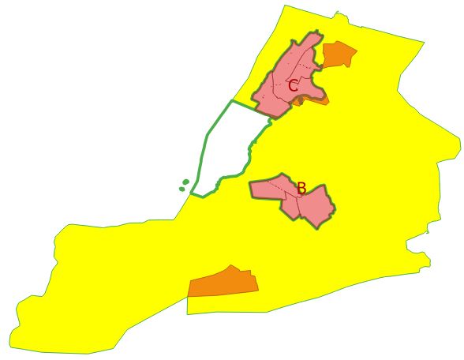
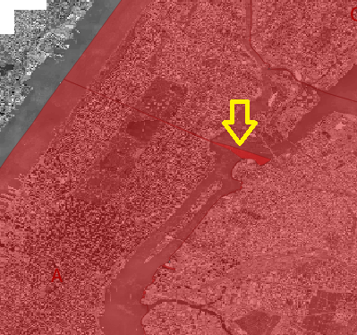

# Poletop Zones Update


## Data In This Repo

All final datasets are in "WGS84" longitude/latitude.  

    https://epsg.io/4326

In the top-level directory click on oldzones.geojson and newzones.geojson to 
visualize zone boundaries right here on GitHub.

Inside the "kml" folder is the same data in Keyhole Markup Language, commonly
used in Google Earth.

Inside the "shp" folder is the same data in shapefile format, commonly used in
desktop GIS software like [QGIS](https://www.qgis.org/en/site/) and ESRI's ArcMap.


## Work Details

Inside the "work" folder are the source data and steps used to create new zones and impacted poletop installations.  

* community_districts.shp: [NYC Open Data Community Districts](https://data.cityofnewyork.us/dataset/Community-Districts-Water-Areas-Included-/mzpm-a6vd) downloaded Feb 25, 2020.

* Mobile_Telecommunication_Franchise_Poletop_Installation_Locations.csv: [NYC Open Data Mobile Telecommunication Franchise Poletop Installation Locations](https://data.cityofnewyork.us/City-Government/Mobile-Telecommunication-Franchise-Poletop-Install/tbgj-tdd6) downloaded Feb 26, 2020.

* oldzones.shp: Mobile Telecommunication Franchise Poletop zones (Not on NYC Open Data)

1. Create a scratch [PostGIS](https://github.com/mattyschell/howdoipostgis) database 

```shell
$ psql
postgres=# create database poletopscratch;
CREATE DATABASE
postgres=# create user poletopuser with password 'postgisismydatabae!';
CREATE ROLE
postgres=# grant all privileges on database poletopscratch to poletopuser;
GRANT
postgres=# \connect poletopscratch
You are now connected to database "poletopscratch" as user "poletopuser".
poletopscratch=# create extension postgis;
CREATE EXTENSION
poletopscratch=# \q
```

2. Load community districts using shp2pgsql.

```shell
$ shp2pgsql -s 4326 -g geometry -c community_districts.shp community_districts > /c/matt_projects/poletop_zones/work/community_districts.sql
$ psql -f community_districts.sql
```

3. Load poletop zones using shp2pgsql

```shell
$ shp2pgsql -s 4326 -g geometry -c oldzones.shp oldzones > /c/matt_projects/poletop_zones/work/oldzones.sql
$ psql -f oldzones.sql
```

4. Create new zones, index old zones while we're at it
```sql
create table newzones (
	objectid serial NOT NULL,
	"name" varchar(20) NULL,
	geometry geometry(MULTIPOLYGON, 4326) NULL,
	constraint newzones_pkey PRIMARY KEY (objectid)
);
create index if not exists newzonesgeometry on newzones using GIST(geometry);
alter table newzones alter column geometry set not null;
create index if not exists oldzonesgeometry on oldzones using GIST(geometry);
alter table newzones alter column geometry set not null;

```

5. Define New Zone C using exclusively community districts: 

| Community District | Zone |
| ------------------ | ---- |
| 201                | C    |
| 202                | C    |
| 204                | C    |
| 205                | C    |
| 207                | C    |
| 313                | C    |
| 316                | C    |

Use the old +/- buffer trick to remove gaps.

```sql
insert into newzones (name, geometry)
SELECT 'C',
       st_buffer(st_buffer(ST_Multi(ST_Union(geometry)),.000001,'join=mitre'),(0-.000001),'join=mitre')  geom
     FROM community_districts
where boro_cd IN (201,202,204,205,207,313,316);
```


6. Define New Zone B stem cells using community districts:

| Community District | Zone |
| ------------------ | ---- |
| 110                | B    |
| 111                | B    |
| 203                | B    |
| 206                | B    |
| 211                | B    |
| 303                | B    |
| 304                | B    |
| 305                | B    |

```sql
insert into newzones (name, geometry)
SELECT 'B',
       st_buffer(st_buffer(ST_Multi(ST_Union(geometry)),.000001,'join=mitre'),(0-.000001),'join=mitre')  geom
     FROM community_districts
where boro_cd IN (110,111,203,206,211,303,304,305)
```

7. Starting with old zone B, subtract new zone C add new zone B.

New Matt is gonna need a pic from old Matt.  Here ya go friend.



```sql
insert into newzones 
    (name
    ,geometry)
select
    'B'
    ,st_multi(st_union(st_difference(o.geometry, n.geometry),nn.geometry))
from
    oldzones o
   ,newzones n
   ,newzones nn
where
    o.name = 'Zone B'
and n.name = 'C'
and nn.name = 'B'
```

8. Remove stem cell zone B and gaps in final zone B. 

```sql
delete from newzones
where 
   objectid = (select min(objectid) from newzones where name = 'B');
update newzones
set
    geometry = st_buffer(st_buffer(geometry,.001,'join=mitre'),(0-.001),'join=mitre')
where 
    name = 'B';
```

9. Add Zone A, subtract where new Zones B and C specified by community districts overlap.

```sql
insert into newzones (
    name
   ,geometry
) select
    'A'
    ,ST_MULTI(ST_UNION(ST_Difference(o.geometry, n.geometry)))
from 
    oldzones o
   ,newzones n
where 
    o.name = 'Zone A'
and n.name = 'B'
```



