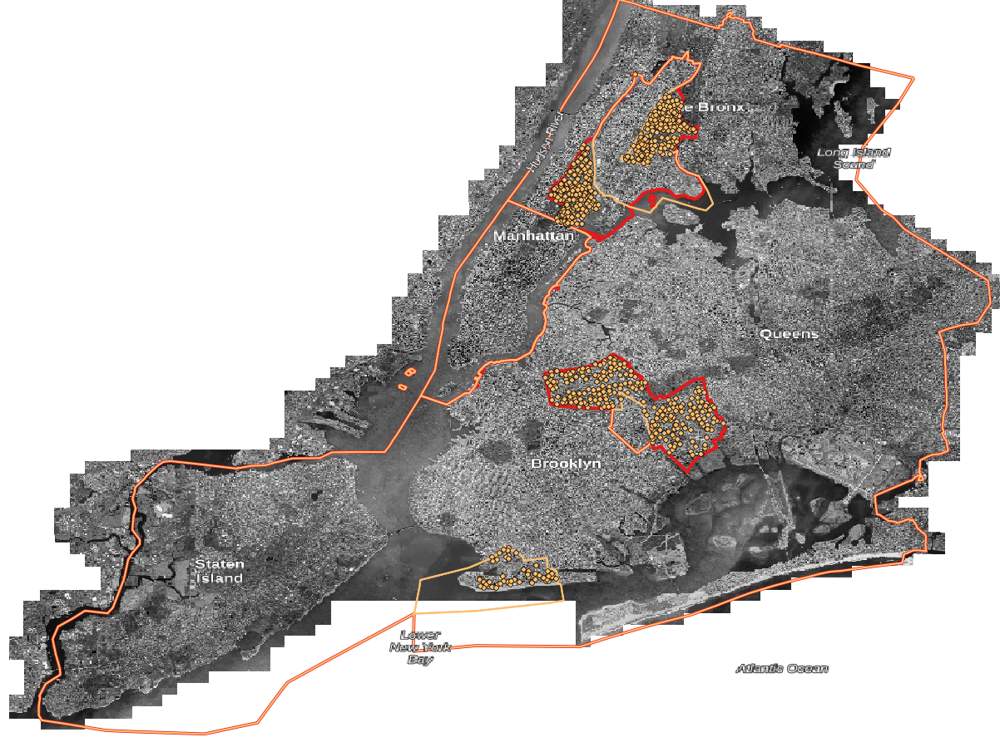

# Poletop Zones Update


## Data In This Repo

All final datasets are in "WGS84" longitude/latitude.  

    https://epsg.io/4326

In the top-level directory click on oldzones.geojson and newzones.geojson to 
visualize zone boundaries right here on GitHub.

Inside the "kml" folder is the same data in Keyhole Markup Language, commonly
used in Google Earth.

Inside the "shp" folder is the same data in shapefile format, commonly used in
desktop GIS software like [QGIS](https://www.qgis.org/en/site/) and ESRI's ArcMap.


## Work Details

Inside the "work" folder are the source data and steps used to create new zones and impacted poletop installations.  

* community_districts.shp: [NYC Open Data Community Districts](https://data.cityofnewyork.us/dataset/Community-Districts-Water-Areas-Included-/mzpm-a6vd) downloaded Feb 25, 2020.

* Mobile_Telecommunication_Franchise_Poletop_Installation_Locations.csv: [NYC Open Data Mobile Telecommunication Franchise Poletop Installation Locations](https://data.cityofnewyork.us/City-Government/Mobile-Telecommunication-Franchise-Poletop-Install/tbgj-tdd6) downloaded Feb 26, 2020.

* oldzones.shp: Mobile Telecommunication Franchise Poletop zones (Not on NYC Open Data)

1. Create a scratch [PostGIS](https://github.com/mattyschell/howdoipostgis) database 

```shell
$ psql
postgres=# create database poletopscratch;
CREATE DATABASE
postgres=# create user poletopuser with password 'postgisismydatabae!';
CREATE ROLE
postgres=# grant all privileges on database poletopscratch to poletopuser;
GRANT
postgres=# \connect poletopscratch
You are now connected to database "poletopscratch" as user "poletopuser".
poletopscratch=# create extension postgis;
CREATE EXTENSION
poletopscratch=# \q
```

2. Load community districts using shp2pgsql.

```shell
$ shp2pgsql -s 4326 -g geometry -c community_districts.shp community_districts > /c/matt_projects/poletop_zones/work/community_districts.sql
$ psql -f community_districts.sql
```

3. Load poletop zones using shp2pgsql

```shell
$ shp2pgsql -s 4326 -g geometry -c oldzones.shp oldzones > /c/matt_projects/poletop_zones/work/oldzones.sql
$ psql -f oldzones.sql
```

4. Create new zones, index old zones while we're at it
```sql
create table newzones (
	objectid serial NOT NULL,
	"name" varchar(20) NULL,
	geometry geometry(MULTIPOLYGON, 4326) NULL,
	constraint newzones_pkey PRIMARY KEY (objectid)
);
create index if not exists newzonesgeometry on newzones using GIST(geometry);
alter table newzones alter column geometry set not null;
create index if not exists oldzonesgeometry on oldzones using GIST(geometry);
alter table newzones alter column geometry set not null;

```

5. Define New Zone C using exclusively community districts: 

| Community District | Zone |
| ------------------ | ---- |
| 201                | C    |
| 202                | C    |
| 204                | C    |
| 205                | C    |
| 207                | C    |
| 313                | C    |
| 316                | C    |

Use the old +/- buffer trick to remove gaps.

.000001 degrees is approximately .1 meters or 4 inches.  Safe.

```sql
insert into newzones (name, geometry)
SELECT 'C',
       st_buffer(st_buffer(ST_Multi(ST_Union(geometry)),.000001,'join=mitre'),(0-.000001),'join=mitre')  geom
     FROM community_districts
where boro_cd IN (201,202,204,205,207,313,316);
```


6. Define New Zone B stem cells using community districts:

| Community District | Zone |
| ------------------ | ---- |
| 110                | B    |
| 111                | B    |
| 203                | B    |
| 206                | B    |
| 211                | B    |
| 303                | B    |
| 304                | B    |
| 305                | B    |

```sql
insert into newzones (name, geometry)
SELECT 'BSTEM',
       st_buffer(st_buffer(ST_Multi(ST_Union(geometry)),.000001,'join=mitre'),(0-.000001),'join=mitre')  geom
     FROM community_districts
where boro_cd IN (110,111,203,206,211,303,304,305)
```

7. Starting with old zone B, subtract new zone C add new zone B.

New Matt is gonna need a pic from old Matt.  Here ya go friend.


```sql
insert into newzones 
    (name
    ,geometry)
select
    'B'
    ,st_multi(st_union(st_difference(o.geometry, n.geometry),nn.geometry))
from
    oldzones o
   ,newzones n
   ,newzones nn
where
    o.name = 'Zone B'
and n.name = 'C'
and nn.name = 'BSTEM'
```

8. Remove stem cell zone B

```sql
delete from newzones name = 'BSTEM'
```

9. Add original zone A which is specially defined in the contract along 96th 
street. Subtract any Zone A overlap from new zone B and C. new Zones B and C specified by community districts overlap.

```sql
insert into newzones (
    name
   ,geometry
) select
    'A'
    ,ST_MULTI(ST_UNION(o.geometry))
from 
    oldzones o
where 
    o.name = 'Zone A';
update newzones 
set geometry = (
    select 
        st_difference(c.geometry, a.geometry)
    from 
        newzones a
       ,newzones c
    where
        a.name = 'A'
    and c.name = 'C'
) where name = 'C';
update newzones 
set geometry = (
    select 
        st_multi(st_difference(c.geometry, a.geometry))
    from 
        newzones a
       ,newzones c
    where
        a.name = 'A'
    and c.name = 'B'
) where name = 'B'
```


10. Attempt to remove interior rings in Zone B. 

```sql
--look at the areas of the rings, should be 2 big, rest small
SELECT b.the_geom AS final_geom, ST_Area(b.the_geom) AS area
  FROM (SELECT (ST_DumpRings(a.geom)).geom AS the_geom
          FROM (SELECT ST_GeometryN(geometry, generate_series(1, ST_NumGeometries(geometry))) AS geom 
                FROM newzones where name = 'B') a
        ) b
order by area desc;
--thanks Simon https://spatialdbadvisor.com/postgis_tips_tricks/92/filtering-rings-in-polygon-postgis
CREATE OR REPLACE FUNCTION upgis_filter_rings(geometry,FLOAT) RETURNS geometry AS
$$ SELECT ST_BuildArea(ST_Collect(d.built_geom)) AS filtered_geom
     FROM (SELECT ST_BuildArea(ST_Collect(c.geom)) AS built_geom
             FROM (SELECT b.geom
                     FROM (SELECT (ST_DumpRings(ST_GeometryN(ST_Multi($1),/*ST_Multi converts any Single Polygons to MultiPolygons */
                                                            generate_series(1,ST_NumGeometries(ST_Multi($1)) )
                                                            ))).*
                           ) b
                    WHERE b.path[1] = 0 OR
                         (b.path[1] > 0 AND ST_Area(b.geom) > $2)
                   ) c
           ) d
$$
  LANGUAGE 'sql' IMMUTABLE;
--remove slivers  
update newzones set geometry = (
    select ST_MULTI(upgis_filter_rings(a.geometry,.00005))
    from 
        newzones a 
    where a.name = 'B'
) where name = 'B'; 
 drop function upgis_filter_rings;
```

11. Create pole table and import from smaller .csv /work/MTF_Locations_deletecols.csv

(used a GUI tool for the import, should get /copy working) 

```sql
create table opendata_poles ( 
    id integer primary key
   ,latitude numeric
   ,longitude numeric
   ,zone varchar(1)
   ,franchisee varchar(256));
```

11. Create table for poles who are in new zones and insert poles

```sql
create table delta_poles ( 
    id integer primary key
   ,oldzone varchar(1)
   ,newzone varchar(1)
   ,franchisee varchar(256)
   ,geometry geometry(POINT, 4326) NULL
   );
create index if not exists delta_polesgeometry on delta_poles using GIST(geometry);
alter table delta_poles alter column geometry set not null;
insert into delta_poles
    (id
    ,oldzone
    ,newzone
    ,franchisee
    ,geometry)
select o.id
      ,o.zone as oldzone
      ,n.name as newzone
      ,o.franchisee
      ,ST_SetSRID(ST_Point(o.longitude,o.latitude), 4326) as geometry
from
    newzones n
   ,opendata_poles o
where ST_Intersects(n.geometry
                   ,ST_SetSRID( ST_Point( o.longitude, o.latitude), 4326))
and o.zone != n.name
```

12. Manual fixes

* South side of Zone C in Brooklyn: remove 3 gaps
    * Used community district boundaries as the truth
* Zone A NE Corner (Community District 108 crossing into E river): remove 3 gaps
    * This is the spot where legacy poletop zone geometries are the truth
* Zone C in the Bronx: Many manual cleanups


